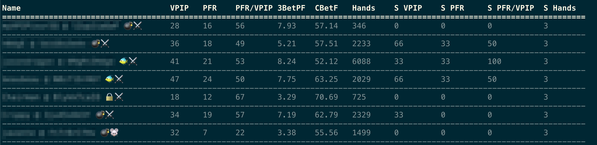

# pnhud

Terminal based heads up display for PokerNow tables



```
OVERVIEW: Command line driven heads up display for PokerNow.club

USAGE: pnhud <game-id> [--stats <stats>]

ARGUMENTS:
  <game-id>               Poker Now Game Id

OPTIONS:
  -s, --stats <stats>     Stats File
  -h, --help              Show help information.

```

### Notes

* Mac only
* Command line only

### How To Run

1. Download the latest [release](https://github.com/pj4533/pnhud/releases)
2. Open a terminal window and find the folder you downloaded to
3. Command to make app executable:  `chmod +x pnhud`
4. Command to run:  `./pnhud <game id>`

You might need to give MacOS permission to run the app, also the 'game id' is the last portion of the PokerNow URL (not the whole URL).

### Stats File Structure

Optionally you can load a CSV file with stats from previous sessions.  This way pnhud will show you both the current session realtime, but also combine it with your older stats on players.  I export my stats from PokerTracker, but as long as they are in the right format, you can do it however you want.  pnhud is very specific for now, so you'll need the stats file in this format, with these column headings:

```
"Player","Hands","Count VPIP","Count PFR"
"player name 1","94","27","14"
"player name 2","34","14","7"
"player name 3","559","116","67"
```

* Hands: number of hands seen
* Count VPIP:  number of hands played
* Count PFR:  number of hands raised preflop

I made a custom report in PokerTracker to export this data as a csv, save it in a folder and run it with pnhud:

`./pnhud <gameid> -s vpip_pfr.csv`
	
### Developer Commands

`swift build` Builds app to the `.build` folder

`swift build -c release` Build a release version

`./.build/debug/pnhud` Runs app after building

`swift run pnhud` Runs app directly

`swift package generate-xcodeproj` Generates an xcode project file
